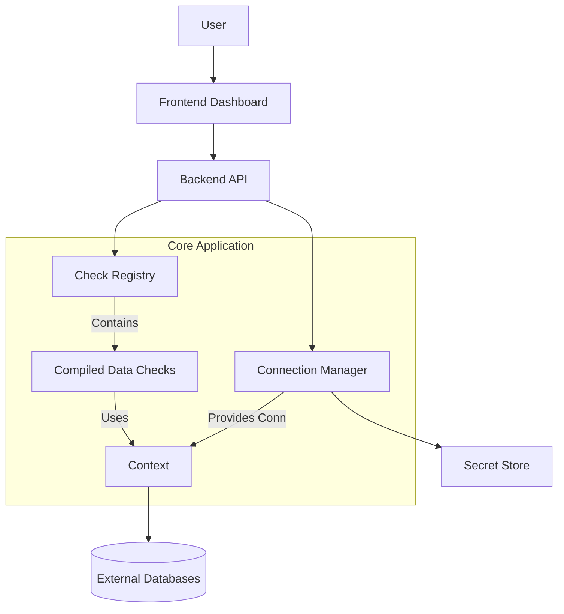

# Design Document: Data Availability Dashboard

## 1. Introduction
The Data Availability Dashboard is an application designed to monitor the availability and status of various datasets used across the organization. It allows users to define data fetching logic as part of the application source code, ensuring robustness and version control. The system executes these checks on demand, managing connections and credentials securely via a standardized configuration interface.

## 2. Requirements

### 2.1 Functional Requirements
*   **Code-Based Checks**: Data fetching logic ("scripts") must be implemented as part of the application's source code (e.g., Rust modules) to ensure stability and control.
*   **Standardized API**: The application must provide a clear API/Trait for developers to implement new checks.
*   **Connection Management**:
    *   Support for defining connections using industry standards (e.g., ODBC-style configurations). "Bring-your-own" config style where user is able to provide their own config files and the configuration is displayed in UI.
    *   GUI interface to manage connection details (DSN, Host, Port, Driver) by generating ODBC config files. This generates ODBC config files from user input which are used by the application to establish connections.
*   **Secret Management**:
    *   Secure handling of credentials.
    *   GUI to configure sources of secrets (e.g., environment variables, vault, or local encrypted storage) to be used with connections.
    * Checks credentials are available for each defined connection.
*   **Parameterization**: Checks must define their required parameters, which the UI will prompt for at runtime.
*   **Execution & Validation**: The system executes the compiled checks, passing parameters and connection handles. The check logic validates the data and returns a status.
*   **Data Privacy**: Fetched data is used solely for validation within the check logic and is discarded immediately after; it is not stored by the application.

### 2.2 Non-Functional Requirements
*   **Robustness**: User-defined logic runs within the application process but must be structured to prevent crashes (error handling).
*   **Auditability**: Since checks are code, they go through standard code review/PR processes.

## 3. Proposed Architecture

The application is a unified Rust binary containing the core engine, the registry of checks, and the UI server.

### 3.1 High-Level Diagram


### 3.2 Components

#### A. The "Script" API (Rust Traits)
Instead of dynamic scripts, users implement a Rust Trait. This ensures type safety and performance.

```rust
/// The context passed to every check, providing access to resources.
pub trait CheckContext {
    /// Get a database connection by its configured name.
    fn get_connection(&self, name: &str) -> Result<Connection, Error>;
}

/// The interface that all data checks must implement.
pub trait DataCheck: Send + Sync {
    /// Unique identifier for the check (e.g., "sales_data_daily")
    fn id(&self) -> &str;
    
    /// Human-readable description
    fn description(&self) -> &str;
    
    /// Define parameters required from the user
    fn parameters(&self) -> Vec<ParameterDefinition>;
    
    /// The logic to fetch and validate data.
    /// Returns Success, Warning, or Failure.
    fn execute(&self, ctx: &dyn CheckContext, params: &HashMap<String, Value>) -> CheckResult;
}
```

#### B. Connection Manager & Secret Store

To ensure secure and flexible credential management, the application decouples connection details from secrets.

**1. Secret Store Interface**
The `SecretStore` trait abstracts the source of credentials.

```rust
/// Interface for retrieving secrets (passwords, API keys).
/// Designed to be async to support remote secret managers (AWS, Vault) in the future.
#[async_trait]
pub trait SecretStore: Send + Sync {
    /// Retrieve a secret by its key/identifier.
    async fn get_secret(&self, key: &str) -> Result<String, SecretError>;
}

// Implementation 1: Environment Variables
// Fetches secrets from process environment variables.
pub struct EnvVarSecretStore;

// Implementation 2: Local File
// Fetches secrets from a local JSON/TOML file (useful for dev/on-prem).
pub struct LocalFileSecretStore { 
    path: PathBuf 
}

// Future Implementation: AWS Secrets Manager
// pub struct AwsSecretManagerStore { client: AwsClient ... }
```

**2. Connection Configuration**
*   **Profiles**: Stored in `connections.toml`.
    *   Fields: `Name`, `Driver`, `ConnectionStringTemplate`, `SecretRef`.
    *   `SecretRef`: Points to a key in the `SecretStore` (e.g., `env:DB_PASSWORD` or `file:prod_db_pass`).

**3. ODBC Integration**
The app uses `odbc-api`. When a check requests a connection, the manager:
1.  Loads the profile.
2.  Resolves the password using the active `SecretStore`.
3.  Injects the password into the connection string.
4.  Returns a pooled connection.

#### C. Frontend UI
*   **Connection Settings**: A form to add/edit Connection Profiles (DSN, User, Password Source).
*   **Dashboard**: Lists all registered `DataCheck` implementations.
*   **Runner**: When a check is selected, the UI renders inputs for the parameters defined in `parameters()`.
*   **Status Display**: Shows the result (Pass/Fail) and any log messages returned by the check.

## 4. Implementation Plan

### Phase 1: Core Framework
1.  Define the `DataCheck` trait and `CheckResult` structs.
2.  Implement a `CheckRegistry` to register checks at compile time (using a macro like `inventory` or `linkme` is common in Rust for this).
3.  Create a basic CLI runner to test the trait.

### Phase 2: Connection Layer
1.  Design the `ConnectionConfig` struct.
2.  Implement the `ConnectionManager` that can read configs and establish ODBC connections.
3.  Implement the `CheckContext` to pass these connections to the checks.

### Phase 3: UI & Integration
1.  Build the API endpoints to:
    *   List available checks.
    *   Get check details (params).
    *   Execute a check.
    *   CRUD connections.
2.  Build the Frontend (Web or Desktop) to interact with these APIs.

## 5. Example User Workflow
1.  **Developer** adds a new file `src/checks/finance_daily.rs`.
    *   Implements `DataCheck` for struct `FinanceDaily`.
    *   Defines logic: `ctx.get_connection("DataWarehouse")?.query("SELECT count(*) FROM daily_sales WHERE date = ?", params.get("date"))`.
    *   Registers it.
2.  **App Owner** deploys the updated app.
3.  **User** opens the App UI.
4.  **User** goes to Settings -> Connections and adds "DataWarehouse" with ODBC details.
5.  **User** goes to Dashboard, sees "Finance Daily Check".
6.  **User** clicks it, enters "2023-10-27", and clicks Run.
7.  **App** executes the Rust code, connects to DB, validates count > 0, returns "Success".
